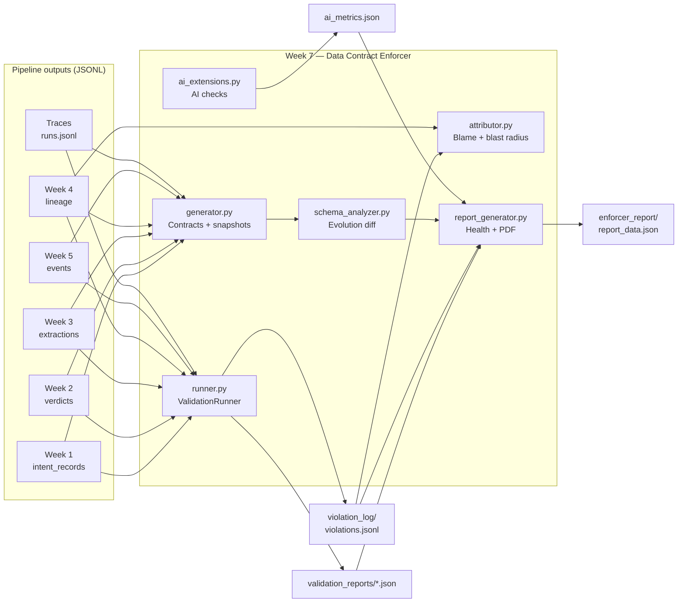
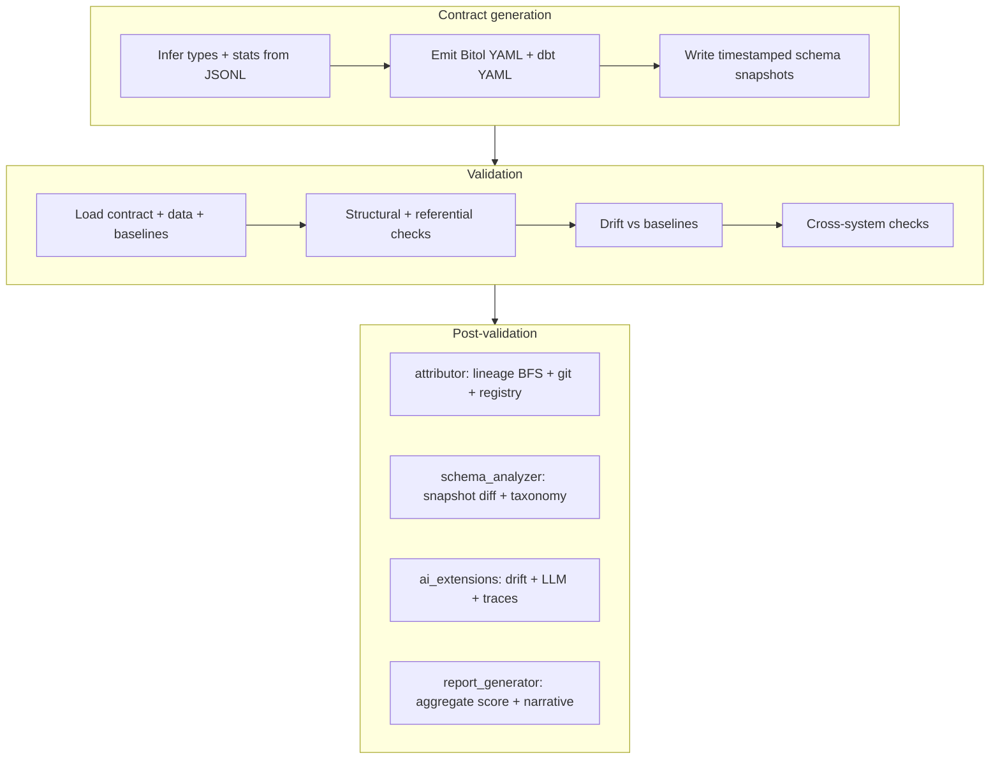

# Data Contract Enforcer (Week 7)

A **data contract enforcement layer** for a multi-week analytics and AI pipeline. It infers **Bitol-style YAML contracts** from JSONL outputs, runs **structural, statistical, and cross-system validation**, enriches failures with **lineage-based attribution** and **subscriber blast radius**, analyzes **schema evolution**, runs **AI-specific checks** (embeddings, prompt inputs, structured LLM outputs, LangSmith traces), and emits a **machine-readable health report** plus optional PDF.

---

## Table of contents

- [Capabilities](#capabilities)
- [Architecture](#architecture)
- [Prerequisites](#prerequisites)
- [Quick start](#quick-start)
- [Validation modes](#validation-modes)
- [Repository layout](#repository-layout)
- [Contract registry](#contract-registry)
- [Full pipeline (practitioner checklist)](#full-pipeline-practitioner-checklist)
- [Tests and CI](#tests-and-ci)
- [Further documentation](#further-documentation)

---

## Capabilities

| Area | Description |
|------|-------------|
| **Contract generation** | Profiles JSONL, emits Bitol YAML, dbt tests, timestamped schema snapshots under `schema_snapshots/`. |
| **Validation** | Per-system checks (Weeks 1–5, LangSmith) plus cross-system checks (e.g. W1→W2, W3→W4). |
| **Statistical drift** | Compares numeric field distributions to baselines in `schema_snapshots/baselines.json`. |
| **Violation attribution** | Week 4 lineage graph + reverse BFS + optional `git` history; ranks candidate producer files. |
| **Blast radius** | `contract_registry/subscriptions.yaml` defines downstream consumers; forward lineage enriches impact. |
| **Schema evolution** | Diff consecutive snapshots; classify breaking vs compatible changes; migration / rollback hints. |
| **AI extensions** | Embedding drift (OpenAI or local hashing fallback), prompt-input JSON Schema checks, LLM output schema rate, trace validation. |
| **Reporting** | `enforcer_report/report_data.json` (health score, severities, recommended actions) and `report_*.pdf`. |

---

## Architecture

### System context

Upstream **producer systems** (Weeks 1–5) and **observability** (LangSmith-style traces) write JSONL under `outputs/`. The enforcer **does not** own those pipelines; it **observes, contracts, and validates** their outputs.



### Component responsibilities



### Health score (report generator)

The **data health score** (0–100) is computed from **deduplicated failing checks** across structured JSON files in `validation_reports/*.json` (files with a top-level `results` array; `ai_metrics.json` and `migration_impact_*.json` are excluded from this scan). Each failure applies a severity deduction (e.g. CRITICAL −20, HIGH −10). **Any leftover `validation_reports/*.json` containing FAIL/ERROR rows lowers the score** — remove demo artifacts such as `violated.json` after exercises if you want a **100** aggregate.

### Optional LLM usage

Core validation runs **without** API keys. Put keys in **`.env`** (see [Configuration via `.env`](#configuration-via-env)). Optional integrations:

- **`contracts/generator.py`**: Tries **Anthropic → OpenRouter → OpenAI** for richer contract annotations when keys are set (see env vars below).
- **`contracts/ai_extensions.py`**: Embedding drift via **OpenRouter** (`USE_OPENROUTER_EMBEDDINGS=1` + `OPENROUTER_API_KEY`), else **OpenAI** `text-embedding-3-small` when `OPENAI_API_KEY` is set, else **HashingVectorizer**.

---

## Prerequisites

```bash
pip install -r requirements.txt
```

Use `python` or `py -3` according to your environment. On Windows PowerShell, commands below work the same with `python` replaced by `py -3` if needed.

### Configuration via `.env`

API keys and flags are read from the **repository root** using [python-dotenv](https://github.com/theskumar/python-dotenv):

1. Copy **`.env.example`** → **`.env`** (and optionally **`.env.local`** for machine-only overrides).
2. On import, `contracts/common.py` loads **`.env`** first, then **`.env.local`** (values in `.env.local` override `.env`). Variables already set in the shell or CI are **not** replaced by `.env`.

Any module that imports `contracts.common` (e.g. `generator.py`, `runner.py`) or calls `load_repo_dotenv()` explicitly (`ai_extensions.py`) will see these values.

### Optional environment variables

| Variable | Effect |
|----------|--------|
| `USE_YDATA=1` | Enable ydata-profiling in `contracts/generator.py` |
| `ANTHROPIC_API_KEY` | LLM annotations in generator (Anthropic) |
| `OPENAI_API_KEY` | LLM annotations (OpenAI) or embedding drift |
| `OPENROUTER_API_KEY` | Chat annotations (generator) and optional embeddings (see below) |
| `OPENROUTER_BASE_URL` | OpenRouter API base (default `https://openrouter.ai/api/v1`) |
| `OPENROUTER_CHAT_MODEL` | Chat model for generator (default `openai/gpt-4o-mini`) |
| `OPENROUTER_EMBEDDING_MODEL` | Embedding model for drift when using OpenRouter (default `openai/text-embedding-3-small`) |
| `OPENROUTER_HTTP_REFERER`, `OPENROUTER_X_TITLE` | Optional OpenRouter attribution headers |
| `USE_OPENROUTER_EMBEDDINGS=1` | Use OpenRouter for embedding drift instead of direct OpenAI |
| `CONTRACT_LLM_OFF=1` | Force offline stub annotations in generator |
| `EMBEDDING_OFF=1` | Skip API embeddings (OpenAI/OpenRouter); use hashing fallback |
| `CONTRACT_LLM_MODEL` | OpenAI chat model for generator (default `gpt-4o-mini`) |
| `ANTHROPIC_CONTRACT_MODEL` | Anthropic model for generator (default `claude-3-5-haiku-20241022`) |

---

## Quick start

**1. Seed sample JSONL** (55+ rows where applicable, lineage nodes for Week 3 `doc_id`, traces, etc.)

```bash
python scripts/seed_outputs.py
```

**2. Generate all contracts and snapshots**

```bash
python contracts/generator.py --all
```

**3. Validate primary evaluator paths (Week 3 and Week 5, AUDIT mode)**

```bash
python contracts/runner.py --contract generated_contracts/week3_extractions.yaml --data outputs/week3/extractions.jsonl --output validation_reports/week3_latest.json --mode AUDIT
python contracts/runner.py --contract generated_contracts/week5_events.yaml --data outputs/week5/events.jsonl --output validation_reports/week5_latest.json --mode AUDIT
```

**4. Run remaining weeks, LangSmith contract, and cross-system checks**

```bash
python contracts/runner.py --contract generated_contracts/week1_intent_records.yaml --data outputs/week1/intent_records.jsonl --output validation_reports/week1_latest.json
python contracts/runner.py --contract generated_contracts/week2_verdicts.yaml --data outputs/week2/verdicts.jsonl --output validation_reports/week2_latest.json
python contracts/runner.py --contract generated_contracts/week4_lineage.yaml --data outputs/week4/lineage_snapshots.jsonl --output validation_reports/week4_latest.json
python contracts/runner.py --contract generated_contracts/langsmith_traces.yaml --data outputs/traces/runs.jsonl --output validation_reports/langsmith_latest.json
python contracts/runner.py --cross-dependencies --output validation_reports/cross_latest.json
```

**5. AI metrics, report, and tests**

```bash
python contracts/ai_extensions.py
python contracts/report_generator.py
pytest -q
```

Artifacts: `validation_reports/*.json`, `validation_reports/ai_metrics.json`, `enforcer_report/report_data.json`, `enforcer_report/report_YYYYMMDD.pdf`.

---

## Validation modes

`contracts/runner.py` `--mode` affects **process exit code** after the report is written (default **AUDIT** = exit 0):

| Mode | Behavior |
|------|----------|
| **AUDIT** | Run all checks; always exit **0**. |
| **WARN** | Exit **1** if any result has `status=FAIL` and `severity=CRITICAL`. |
| **ENFORCE** | Exit **1** if any `FAIL` has severity **CRITICAL** or **HIGH**. |

---

## Repository layout

| Path | Role |
|------|------|
| `contracts/generator.py` | Contract generation + snapshots + optional LLM annotations |
| `contracts/runner.py` | ValidationRunner; writes JSON reports and may append `violation_log/violations.jsonl` |
| `contracts/validation_checks.py` | Check implementations (weeks, LangSmith, cross-system) |
| `contracts/attributor.py` | ViolationAttributor; blame chain + blast radius |
| `contracts/registry.py` | Load `contract_registry/subscriptions.yaml` |
| `contracts/schema_analyzer.py` | Schema evolution diff + migration hints |
| `contracts/ai_extensions.py` | Embedding drift, prompt validation, LLM output schema, traces |
| `contracts/report_generator.py` | `report_data.json` + PDF |
| `contracts/violation_record.py` | Shared violation shape helpers |
| `contract_registry/subscriptions.yaml` | Downstream subscribers for blast radius |
| `outputs/` | Producer JSONL inputs |
| `generated_contracts/` | Generated Bitol YAML, dbt, JSON Schemas |
| `schema_snapshots/` | Versioned schema YAML + `baselines.json` |
| `validation_reports/` | Runner and analyzer outputs (`*_latest.json`, `ai_metrics.json`, …) |
| `violation_log/` | `violations.jsonl`, `violations_with_blame.jsonl` |
| `enforcer_report/` | Aggregated report JSON + PDF |
| `scripts/seed_outputs.py` | Deterministic sample data |
| `scripts/refresh_submission_artifacts.py` | Dedupe `violations.jsonl` after repeated AI runs |
| `create_violation.py` | Optional Week 3 scale-change demo file |
| `src/week*/` | Stub / producer code paths referenced by contracts |
| `REPORT.md` | Formal narrative + diagrams (submission-style) |
| `DOMAIN_NOTES.md` | Design notes, taxonomy, trust boundaries |

---

## Contract registry

**`contract_registry/subscriptions.yaml`** (Tier 1) lists **who consumes** each `contract_id`, which **fields** they depend on, and which **breaking_fields** trigger blast-radius matching. Loaded by `contracts/registry.py` and `contracts/attributor.py`.

---

## Full pipeline (practitioner checklist)

Run from the repository root (directory containing `contracts/` and `outputs/`).

### Baseline

```bash
pip install -r requirements.txt
python scripts/seed_outputs.py
```

Confirm inputs exist: `outputs/week3/extractions.jsonl`, `outputs/week4/lineage_snapshots.jsonl`, `outputs/week5/events.jsonl`, `outputs/traces/runs.jsonl`.

### Registry sanity

```bash
# Example: count subscriber entries (Unix)
grep -c subscriber_id contract_registry/subscriptions.yaml
```

### Generate contracts (full bundle or per source)

```bash
python contracts/generator.py --all
```

Evaluators may instead run single-source generation, for example:

```bash
python contracts/generator.py --source outputs/week3/extractions.jsonl --output generated_contracts/
```

Expect `generated_contracts/week3_extractions.yaml`, `week5_events.yaml`, dbt artifacts, and new trees under `schema_snapshots/<contract-id>/`.

### Clean validation (AUDIT)

```bash
python contracts/runner.py --contract generated_contracts/week3_extractions.yaml --data outputs/week3/extractions.jsonl --mode AUDIT --output validation_reports/clean.json
```

### Optional: injected scale violation (demo)

```bash
python create_violation.py
python contracts/runner.py --contract generated_contracts/week3_extractions.yaml --data outputs/week3/extractions_violated.jsonl --mode ENFORCE --output validation_reports/violated.json
```

Expect **FAIL** on confidence **range** and **statistical_drift** when baselines were established from clean data.

**Important:** For a **green aggregate health score** in `report_generator.py`, **delete `validation_reports/violated.json`** after the demo. The report generator scans **all** structured `validation_reports/*.json` and applies deductions for any **FAIL** / **ERROR** rows.

### Violation attributor

`--violation` accepts a ValidationRunner JSON report and converts **FAIL/ERROR** `results[]` rows into attributed violations (does not merge the full historical `violations.jsonl`).

```bash
python contracts/attributor.py --violation validation_reports/violated.json --lineage outputs/week4/lineage_snapshots.jsonl --registry contract_registry/subscriptions.yaml --output violation_log/violations_with_blame.jsonl
```

Or enrich an existing log:

```bash
python contracts/attributor.py --input violation_log/violations.jsonl --lineage outputs/week4/lineage_snapshots.jsonl --registry contract_registry/subscriptions.yaml --output violation_log/violations_with_blame.jsonl
```

### Deduplicate violations (after repeated `ai_extensions` runs)

```bash
python scripts/refresh_submission_artifacts.py
```

### Schema evolution

```bash
python contracts/schema_analyzer.py --contract-id week3-document-refinery-extractions --since "7 days ago" --output validation_reports/schema_evolution_week3.json
```

Also emits `validation_reports/migration_impact_<contract_id>_<timestamp>.json`.

### AI extensions (explicit I/O)

```bash
python contracts/ai_extensions.py --extractions outputs/week3/extractions.jsonl --verdicts outputs/week2/verdicts.jsonl --output validation_reports/ai_metrics.json --also-write-ai-extensions-name
```

### Enforcer report

```bash
python contracts/report_generator.py
```

Verify `enforcer_report/report_data.json`: `data_health_score`, `violations_by_severity`, `recommended_actions`, and alignment with `validation_reports/*.json`.

### Tests

```bash
pytest -q
```

---

## Tests and CI

GitHub Actions (`.github/workflows/ci.yml`) runs contract generation, ValidationRunner on Week 3 and Week 5 with `--mode AUDIT`, and `pytest`.

---

## Further documentation

- **`REPORT.md`** — End-to-end narrative, validation evidence, schema evolution case study, and rubric-oriented sections.
- **`DOMAIN_NOTES.md`** — Backward-compatibility taxonomy, Bitol examples, lineage blame discussion, and production-oriented failure modes.
- **`contracts/ATTRIBUTION_OPERATIONS.md`** — Git and lineage assumptions, monorepo / `CONTRACT_ENFORCER_GIT_TOPLEVEL`, lineage freshness env vars, and output fields (`attribution_context`).
