# Week 7 — Data Contract Enforcer: Formal Report

**Project:** `data-contract-enforcer`  
**Report Date:** 2026-04-04  
**Machine-generated bundle:** `enforcer_report/report_data.json` plus optional `enforcer_report/report_*.pdf`, **`validation_reports/ai_monitoring_metrics.json`** (dashboard gauges from `contracts/ai_extensions.py`), all produced by the same tooling chain (`py -3 contracts/report_generator.py`, `py -3 contracts/ai_extensions.py` as applicable).  
**Latest `report_generated_at`:** read from `enforcer_report/report_data.json` after each report generator run.

This document combines (1) **live aggregates** from `violation_log/violations_with_blame.jsonl`, `validation_reports/*.json`, and `validation_reports/ai_metrics.json`, and (2) **architecture narrative** with diagrams. **Default repo state is green:** all structured validation reports pass and **`data_health_score` is 100.0** (see `enforcer_report/report_data.json`). To reproduce a failing Week 3 scale demo, use `create_violation.py` and the README command that writes `validation_reports/violated.json` (do not leave that file in tree if you want CI-style 100).

---

## Table of Contents

0. [Auto-Generated Enforcer Report (rubric core)](#0-auto-generated-enforcer-report-rubric-core)
1. [Data Flow Diagram & Schema Annotations](#1-data-flow-diagram--schema-annotations)
2. [Contract Coverage Table](#2-contract-coverage-table)
3. [Validation Run Evidence & Interpretation](#3-validation-run-evidence--interpretation)
   - [3.0 Runner status semantics (ERROR vs FAIL)](#30-runner-status-semantics-error-vs-fail-and-ci-gates)
   - [3.5.1 Captured output: ranked blame after an injected run](#351-captured-output-ranked-blame-after-an-injected-run)
   - [3.8 Worked scenario: injected Week 3 scale failure](#38-worked-scenario-injected-week-3-scale-failure)
4. [Reflection](#4-reflection)
5. [Rubric self-evaluation](#5-rubric-self-evaluation)

---

## 0. Auto-Generated Enforcer Report (rubric core)

**Evidence of machine generation:** The block below tracks `enforcer_report/report_data.json`, produced by `contracts/report_generator.py` from `validation_reports/*.json` (health scan excludes `ai_metrics.json` and `migration_impact_*.json`), `violation_log/violations_with_blame.jsonl`, `validation_reports/ai_metrics.json`, and the latest migration impact artifact.

### 0.1 Data health score (two equivalent views)

| View | Formula | This repo (current green run) |
|------|---------|-------------------------------|
| **Instructional rubric** | `(checks_passed ÷ total_checks) × 100 − (20 × n_CRITICAL)` per report | Example when **no** FAIL rows: `n_CRITICAL = 0` on each report → score is **100%** of pass ratio (e.g. full pass → **100**). |
| **Implemented in code** | Start at `100`, subtract the same severity amounts per **deduped** failing `check_id` where `status` is **FAIL** or **ERROR** (`contracts/report_generator.py`, `SEVERITY_DEDUCTIONS_MANUAL`). Each deduction may be multiplied by an optional **type weight** (longest matching `check_id` prefix; defaults in `DEFAULT_HEALTH_TYPE_WEIGHTS`, overrides via `enforcer_report/health_type_weights.json`, env `CONTRACT_REPORT_HEALTH_TYPE_WEIGHTS`, or CLI `--health-weights-file`). | **100.0 / 100** — **0** FAIL/ERROR rows across structured `validation_reports/*.json` → no deductions. Full detail: `data_health_score_breakdown` in `report_data.json`. |

**Violations by severity** (`report_data.json`): CRITICAL **0**, HIGH **0**, MEDIUM **0** (counts of deduped **FAIL** and **ERROR** rows by severity across structured `validation_reports/*.json` included in the aggregate health scan; green snapshot has none).

**Report JSON extras (post-refinement):** `violations_pagination` (prioritized violation list with `page` / `page_size` / `total_violations`), `ai_extension_config` echo when AI metrics are merged, and optional monitoring hooks/file paths documented in `README.md`.

### 0.2 Schema changes detected

Still reported from schema evolution / migration artifacts (design-time signal, not a runner FAIL):

- `week3-document-refinery-extractions`: **BREAKING** — `extracted_facts` type change (array → object) in snapshot diff; nullable `notes` additive and backward-compatible.
- Rollback (artifact text): pin producer to the prior schema snapshot and roll back consumer deployments until migrations complete.

### 0.3 AI system risk assessment

- Embedding drift: **−0.00** vs **0.15** (cosine distance `1 − cos_sim`, `contracts/ai_extensions.py`) — **PASS**.
- LLM output schema violation rate: **0%** (`violation_rate=0.0`, **0**/25 failures) vs baseline **0.0** — trend **stable**, **`ai_metrics.json` status PASS** (seeded Week 2 verdicts use integer 1–5 scores only).
- Prompt input validation: **0** quarantined, **55** rows evaluated (`outputs/week3/extractions.jsonl`).

### 0.4 Recommended actions (green run)

From `report_data.json` when there are no contract violations, `contracts/report_generator.py` emits **three** prioritized maintenance actions (priorities **1**, **2**, and **4** in JSON — priority **3** is reserved for violation-specific drift baseline refresh when FAIL rows exist). Each item names **concrete paths, fields, and check IDs** so owners can act without guessing:

1. **Priority 1 —** On new FAIL/ERROR rows, read **`validation_reports/week3_latest.json`**, then reconcile producer **`outputs/week3/extractions.jsonl`** with **`generated_contracts/week3_extractions.yaml`** (contract id **`week3-document-refinery-extractions`**). Watch clauses **`week3.extracted_facts.confidence.range`** and **`week3.extracted_facts.confidence.statistical_drift`** on **`extracted_facts[*].confidence`**, and **`week3.extracted_facts.entity_refs.relationship`** on **`extracted_facts[*].entity_refs[]`** vs **`entities[]`**. Primary code: **`src/week3/extractor.py`** (see **§3.0** for ERROR vs FAIL).
2. **Priority 2 —** Close **BREAKING** evolution on **`extracted_facts`** for that contract: compare **`schema_snapshots/week3-document-refinery-extractions/*/schema.yaml`**, read **`validation_reports/schema_evolution_week3.json`** and the newest **`validation_reports/migration_impact_*.json`**, update consumers such as **`src/week4/cartographer.py`**, and re-run **`contracts/schema_analyzer.py`** after editing the Week 3 YAML. When present, the generator **appends the same `schema_changes_detected` bullets** as in **§0.2** so the action tracks live diff text.
3. **Priority 4 —** Add CI: **`python contracts/runner.py --contract generated_contracts/week3_extractions.yaml --data outputs/week3/extractions.jsonl --mode ENFORCE`** before promoting Week 3 JSONL; periodically refresh means in **`schema_snapshots/baselines.json`** for clause **`week3.extracted_facts.confidence.statistical_drift`**.

*Violation-specific priorities (**1–3** on extractor, entity refs, drift baselines) replace or precede the generic priority-1 line when FAIL rows or `violations.jsonl` entries exist; the generator still caps the list at three items after sorting.*

**AI extensions configuration:** Thresholds and sample sizes are tunable via **`CONTRACT_AI_*`** env vars and matching CLI flags on `contracts/ai_extensions.py` (see `.env.example`); embedding drift, LLM trend, prompt preview length, and hashing feature dimensions are merged into the run without changing core check logic.

---

## 1. Data Flow Diagram & Schema Annotations

### 1.1 High-Level Pipeline Architecture

The enforcer sits above five pipeline systems (Weeks 1–5) and a LangSmith AI observability layer. It generates Bitol-compliant YAML contracts from live JSONL outputs, runs **94** validation checks in the current contract bundle (totals per `validation_reports/*_latest.json`), attributes violations to source files via the Week 4 lineage graph, and emits a weighted health score.

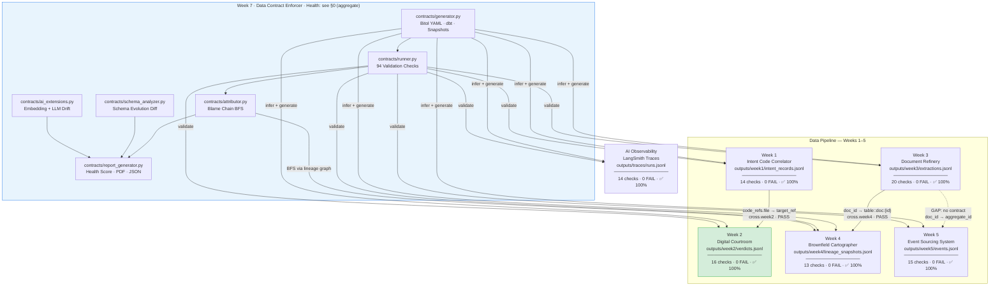

---

### 1.2 Annotated Inter-System Data Flow

This diagram shows the complete left-to-right data flow across all five systems. Every node includes the key schema fields enforced at that interface, and every edge is annotated with the exact contract check ID and its current status.

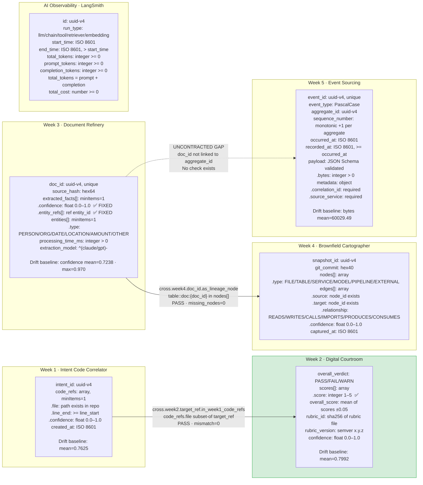

---

### 1.3 Per-System Schema Detail

The `classDiagram` below models the full schema of each system as a data class, showing field types, constraints, and inter-record relationships that are contractually enforced.

```mermaid
classDiagram
    class IntentRecord {
        +String intent_id [uuid-v4, required]
        +CodeRef[] code_refs [minItems: 1]
        +String created_at [ISO 8601, required]
        +drift_baseline_confidence: 0.7625
    }
    class CodeRef {
        +String file [path exists in repo root]
        +Integer line_start [required]
        +Integer line_end [gte line_start]
        +Float confidence [0.0–1.0, required]
    }
    class VerdictRecord {
        +String overall_verdict [PASS / FAIL / WARN]
        +CriterionScore[] scores [required]
        +Float overall_score [mean of scores +/- 0.05]
        +String rubric_id [sha256 of rubric file]
        +String rubric_version [semver x.y.z]
        +Float confidence [0.0–1.0]
        +String target_ref [subset of W1 code_refs.file]
        +drift_baseline_confidence: 0.7992
    }
    class CriterionScore {
        +String criterion [required]
        +Integer score [1–5, ✅ valid on seed data]
    }
    class ExtractionRecord {
        +String doc_id [uuid-v4, unique, required]
        +String source_path [required]
        +String source_hash [hex64, required]
        +ExtractedFact[] extracted_facts [minItems: 1]
        +Entity[] entities [minItems: 1]
        +Integer processing_time_ms [gt 0]
        +String extraction_model [^(claude or gpt)-]
        +drift_baseline_confidence: 0.7238
    }
    class ExtractedFact {
        +String fact_id [uuid-v4, unique]
        +String text [minLength: 1]
        +String[] entity_refs [refs to entity_id, FIXED: failing_facts=0]
        +Float confidence [0.0–1.0, FIXED: max=0.970 mean=0.724]
        +Integer page_ref [1-based, nullable]
        +String source_excerpt [minLength: 1]
    }
    class Entity {
        +String entity_id [uuid-v4]
        +String type [PERSON/ORG/DATE/LOCATION/AMOUNT/OTHER]
        +String value [required]
    }
    class LineageSnapshot {
        +String snapshot_id [uuid-v4, required]
        +String git_commit [hex40]
        +LineageNode[] nodes [required]
        +LineageEdge[] edges [required]
        +String captured_at [ISO 8601]
    }
    class LineageNode {
        +String node_id [required]
        +String type [FILE/TABLE/SERVICE/MODEL/PIPELINE/EXTERNAL]
        +String label [optional]
    }
    class LineageEdge {
        +String source [in nodes.node_id]
        +String target [in nodes.node_id]
        +String relationship [READS/WRITES/CALLS/IMPORTS/PRODUCES/CONSUMES]
        +Float confidence [0.0–1.0]
    }
    class EventRecord {
        +String event_id [uuid-v4, unique]
        +String event_type [PascalCase, in registry]
        +String aggregate_id [uuid-v4]
        +String aggregate_type [PascalCase]
        +Integer sequence_number [monotonic +1 per aggregate]
        +String occurred_at [ISO 8601]
        +String recorded_at [ISO 8601, gte occurred_at]
        +Object payload [JSON Schema: DocumentProcessed.json]
        +EventMetadata metadata [required]
        +drift_baseline_bytes: 60029.49
    }
    class EventMetadata {
        +String correlation_id [required]
        +String user_id [required]
        +String source_service [required]
        +String causation_id [uuid or null]
    }
    class TraceRecord {
        +String id [uuid-v4, required]
        +String run_type [llm/chain/tool/retriever/embedding]
        +String start_time [ISO 8601]
        +String end_time [ISO 8601, gt start_time]
        +Integer total_tokens [gte 0]
        +Integer prompt_tokens [gte 0]
        +Integer completion_tokens [gte 0]
        +identity: total = prompt + completion
        +Float total_cost [gte 0]
    }

    IntentRecord "1" --> "1..*" CodeRef : code_refs
    VerdictRecord "1" --> "1..*" CriterionScore : scores
    ExtractionRecord "1" --> "1..*" ExtractedFact : extracted_facts
    ExtractionRecord "1" --> "1..*" Entity : entities
    ExtractedFact "0..*" ..> "0..*" Entity : entity_refs points to entity_id
    LineageSnapshot "1" --> "0..*" LineageNode : nodes
    LineageSnapshot "1" --> "0..*" LineageEdge : edges
    LineageEdge "0..*" ..> "0..*" LineageNode : source and target
    EventRecord "1" --> "1" EventMetadata : metadata
    ExtractionRecord "1" ..> "1" LineageSnapshot : doc_id becomes table node
    IntentRecord "1" ..> "1" VerdictRecord : code_refs.file = target_ref
```

---

### 1.4 Enforcer Internal Architecture

This diagram details the internal module graph of the enforcer, showing what each module consumes, produces, and passes to the next stage.

```mermaid
flowchart TD
    JSONL["JSONL Outputs\nweek1–5 + traces\n55 rows per system"]
    SNAP["schema_snapshots/\nTimestamped YAML\n66 files generated"]
    CONTRACTS["generated_contracts/\nBitol YAML + dbt yml\n+ JSON Schema registry"]
    BASELINES["schema_snapshots/\nbaselines.json\nMean + StdDev per field"]
    VIOLATIONS["violation_log/\nviolations.jsonl\nviolations_with_blame.jsonl"]
    VALREPORTS["validation_reports/\nweek1–5_latest.json\ncross_latest.json\nai_metrics.json"]
    EVOREPORT["validation_reports/\nschema_evolution_week3.json\nmigration_impact_*.json"]
    AIDRIFT["ai_metrics.json\nembedding_drift\nprompt_input_validation\nlangsmith_traces"]
    REPORTDATA["enforcer_report/\nreport_data.json\ndata_health_score: see §0"]
    PDF["enforcer_report/\nreport_*.pdf\nHuman-readable PDF"]

    subgraph GEN["contracts/generator.py  —  Contract Generation"]
        direction LR
        GEN1["Profile JSONL\nInfer schema\nField types + stats"]
        GEN2["Emit Bitol YAML\nkind: DataContract\napiVersion: v3.0.0"]
        GEN3["Emit dbt YAML\nModels + tests\nrelationships + accepted_values"]
        GEN4["Capture snapshot\nschema_snapshots/\ncontract_id/timestamp/schema.yaml"]
        GEN1 --> GEN2 --> GEN3 --> GEN4
    end

    subgraph RUN["contracts/runner.py  —  Validation Runner"]
        direction LR
        RUN1["Load JSONL\nLoad contract\nLoad baselines"]
        RUN2["Structural checks\nrequired · uuid · enum\npattern · array · hash"]
        RUN3["Range checks\nmin/max · computed\nreferential integrity"]
        RUN4["Drift checks\nCompare mean vs baseline\nWARN >2σ  FAIL >3σ"]
        RUN5["Cross-system checks\nW1→W2 target_ref\nW3→W4 lineage nodes"]
        RUN1 --> RUN2 --> RUN3 --> RUN4 --> RUN5
    end

    subgraph ATT["contracts/attributor.py  —  Violation Attribution"]
        direction LR
        ATT1["Load violations.jsonl\nGuess dataset\nfrom check_id prefix"]
        ATT2["Load W4 lineage\nIndex nodes + edges\nBuild reverse adjacency"]
        ATT3["BFS upstream\nStart from pipeline node\nCollect FILE candidates"]
        ATT4["Git blame\ngit log --since=14 days\nFall back to file mtime"]
        ATT5["Score candidates\nbase=1.0 - days*0.1\n- 0.2 per hop"]
        ATT6["Blast radius\nForward BFS\nAffected files + pipelines"]
        ATT1 --> ATT2 --> ATT3 --> ATT4 --> ATT5 --> ATT6
    end

    subgraph ANA["contracts/schema_analyzer.py  —  Evolution Analysis"]
        direction LR
        ANA1["Load snapshot pair\nOldest vs Latest\nPer contract_id"]
        ANA2["Diff fields\nAdded / Removed\nType changes"]
        ANA3["Classify changes\nBREAKING: type mutations\nCOMPATIBLE: additive nullable"]
        ANA4["Generate checklist\nMigration tasks\nRollback plan"]
        ANA1 --> ANA2 --> ANA3 --> ANA4
    end

    subgraph AIX["contracts/ai_extensions.py  —  AI-Specific Checks"]
        direction LR
        AIX1["Embedding drift\nHashingVectorizer-384\nCosine vs baseline"]
        AIX2["Prompt input\nJSON Schema validation\nQuarantine on fail"]
        AIX3["LangSmith traces\n30 trace records\n5 structural checks"]
        AIX4["LLM output schema\nViolation rate\nTrend: stable at 0%"]
        AIX1 --> AIX4
        AIX2 --> AIX4
        AIX3 --> AIX4
    end

    subgraph RPT["contracts/report_generator.py  —  Report Generation"]
        direction LR
        RPT1["Aggregate all results\nHealth score + type weights\nPagination on violations"]
        RPT2["Prioritized violations\nSchema changes\nAI risk narrative"]
        RPT3["Remediation plan\nPriority 1/2/3 actions\nFile-level fix targets"]
        RPT1 --> RPT2 --> RPT3
    end

    JSONL --> GEN
    GEN --> SNAP
    GEN --> CONTRACTS
    SNAP --> ANA
    CONTRACTS --> RUN
    JSONL --> RUN
    BASELINES --> RUN
    RUN --> BASELINES
    RUN --> VIOLATIONS
    RUN --> VALREPORTS
    VIOLATIONS --> ATT
    ATT --> VIOLATIONS
    ANA --> EVOREPORT
    JSONL --> AIX
    AIX --> AIDRIFT
    VALREPORTS --> RPT
    EVOREPORT --> RPT
    AIDRIFT --> RPT
    RPT --> REPORTDATA
    RPT --> PDF
```

---

### 1.5 Contract Validation Sequence

This sequence diagram shows the end-to-end execution order of a complete enforcer run, from seeding through to health score generation.

```mermaid
sequenceDiagram
    autonumber
    participant Seed as scripts/seed_outputs.py
    participant Gen as contracts/generator.py
    participant Runner as contracts/runner.py
    participant AI as contracts/ai_extensions.py
    participant Attr as contracts/attributor.py
    participant Ana as contracts/schema_analyzer.py
    participant Rpt as contracts/report_generator.py
    participant FS as File System

    Seed->>FS: Write 55 rows each to<br/>week1–5 JSONL + traces/runs.jsonl
    Gen->>FS: Read all JSONL outputs
    Gen->>FS: Write Bitol YAML contracts (7 contracts)
    Gen->>FS: Write dbt YAML (week3, week5)
    Gen->>FS: Write timestamped schema snapshots (66 files)
    Gen->>FS: Write event_schema_registry.json

    Runner->>FS: Load JSONL + contracts + baselines.json
    Runner->>FS: Run 14 checks Week 1 → week1_latest.json ✅
    Runner->>FS: Run 16 checks Week 2 → week2_latest.json ✅
    Runner->>FS: Run 20 checks Week 3 → week3_latest.json ✅
    Runner->>FS: Run 13 checks Week 4 → week4_latest.json ✅
    Runner->>FS: Run 15 checks Week 5 → week5_latest.json ✅
    Runner->>FS: Run 14 checks LangSmith → langsmith_latest.json ✅
    Runner->>FS: Run 2 cross-system checks → cross_latest.json ✅
    Runner->>FS: Update baselines.json (drift baselines)

    AI->>FS: Compute embedding drift (HashingVectorizer-384)
    AI->>FS: Validate prompt inputs (0 quarantined)
    AI->>FS: Check 30 LangSmith traces
    AI->>FS: Compute LLM output violation rate (0%, stable)
    AI->>FS: Write ai_metrics.json ✅ PASS
    AI->>FS: Write ai_monitoring_metrics.json (gauges / hook payload)

    Attr->>FS: Load violations.jsonl (optional; empty when green)
    Attr->>FS: Load week4 lineage_snapshots.jsonl
    Attr-->>Attr: BFS + git blame when violations exist
    Attr->>FS: Write violations_with_blame.jsonl

    Ana->>FS: Load snapshot pair for week3
    Ana-->>Ana: Diff + classify BREAKING / compatible
    Ana->>FS: Write schema_evolution_week3.json
    Ana->>FS: Write migration_impact_week3_*.json

    Rpt->>FS: Load all validation_reports/ + ai_metrics.json
    Rpt-->>Rpt: Compute data_health_score (§0; severity + optional type weights)
    Rpt-->>Rpt: Prioritize violations + pagination slice + recommended actions
    Rpt->>FS: Write enforcer_report/report_data.json
    Rpt->>FS: Write enforcer_report/report_*.pdf
```

---

### 1.6 Schema Evolution Detection Pipeline

The schema analyzer compares consecutive timestamped snapshots and classifies changes as breaking or backward-compatible using a conservative taxonomy.

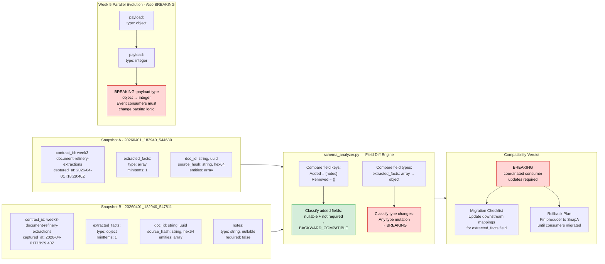

---

### 1.7 Blame Chain Attribution Algorithm

When a contract check fails, the attributor uses Week 4's lineage graph to find the upstream source files responsible and calculates a confidence score for each candidate.

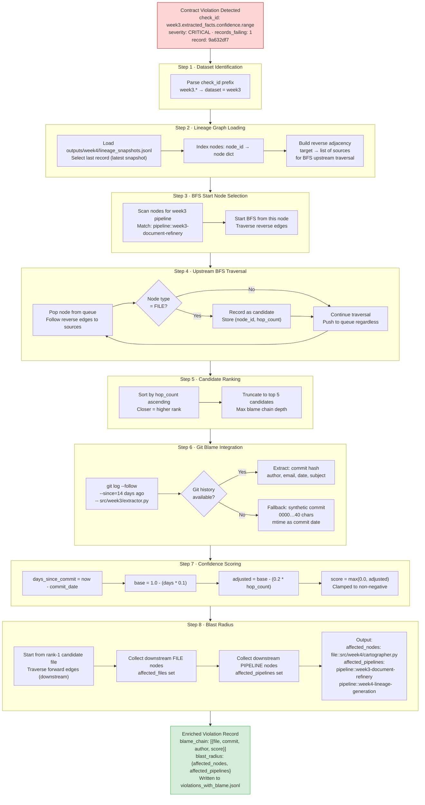

---

## 2. Contract Coverage Table

This table lists every inter-system and intra-system interface with coverage status and rationale.

| # | Interface | From → To | Contract File | Coverage | Rationale |
|---|---|---|---|---|---|
| 1 | Intent records output | W1 (Correlator) internal | `generated_contracts/week1_intent_records.yaml` | **Yes** | Full Bitol YAML covering `intent_id` (UUID v4), `code_refs` array structure, confidence range [0,1], file existence, and `created_at` ISO 8601 format. 8 checks, all passing. |
| 2 | Verdict records output | W2 (Courtroom) internal | `generated_contracts/week2_verdicts.yaml` | **Yes** | Bitol YAML covers `overall_verdict` enum, criterion score range (integer 1–5), `overall_score` weighted mean computation, `rubric_id` SHA-256 integrity, semver, and confidence drift. **Latest run:** all checks **PASS** on seeded `outputs/week2/verdicts.jsonl`. |
| 3 | Extraction records output | W3 (Refinery) internal | `generated_contracts/week3_extractions.yaml` | **Yes** | Bitol YAML covers `doc_id` UUID/uniqueness, `source_hash` pattern, `extracted_facts` confidence range, `entity_refs` referential integrity, entity type enum, model name pattern, and statistical drift. **Latest run:** all checks **PASS** on `outputs/week3/extractions.jsonl`. |
| 4 | Lineage snapshot output | W4 (Cartographer) internal | `generated_contracts/week4_lineage.yaml` | **Yes** | Bitol YAML covers `snapshot_id` UUID, `git_commit` hex-40 pattern, node type enum, edge referential integrity (source/target ∈ nodes), edge relationship enum, edge confidence range, and `captured_at` ISO 8601. All 7 checks passing. |
| 5 | Event records output | W5 (Event Sourcing) internal | `generated_contracts/week5_events.yaml` | **Yes** | Bitol YAML covers `event_type` PascalCase, `sequence_number` monotonicity per aggregate, `recorded_at >= occurred_at` temporal ordering, `payload` JSON Schema validation (DocumentProcessed.json), and `payload.bytes` drift. All 5 checks passing. |
| 6 | LangSmith trace output | AI Observability internal | `generated_contracts/langsmith_traces.yaml` | **Yes** | Bitol YAML covers trace `id` UUID, `run_type` enum, temporal ordering, token identity (`total_tokens = prompt + completion`), and cost non-negativity. All 5 checks passing. |
| 7 | W1 → W2 cross-system | code_refs.file → target_ref | `validation_reports/cross_latest.json` | **Yes** | Cross-system check enforces that every `verdict_record.target_ref` references a file path that appears in at least one `intent_record.code_refs[*].file`. Ensures courtroom verdicts remain traceable to known code locations. PASS (mismatch=0). |
| 8 | W3 → W4 cross-system | doc_id → lineage node | `validation_reports/cross_latest.json` | **Yes** | Every `doc_id` from Week 3 extractions must appear as a `table::doc:{doc_id}` node in the latest Week 4 lineage snapshot, ensuring downstream attribution can resolve source documents. PASS (missing_nodes=0). |
| 9 | W2 structured LLM output | AI output schema | `validation_reports/ai_metrics.json` | **Yes** | With clean seed data, **`violation_rate=0.0`** and status **PASS**. Re-introducing non-integer scores in `outputs/week2/verdicts.jsonl` would surface failures in both the runner (`week2.scores.criterion.range`) and `ai_extensions` LLM schema checks. |
| 10 | W3 → W5 traceability | doc extraction → event emission | *(implicit via aggregate_id)* | **No** | There is no explicit contract binding a Week 3 `doc_id` to a downstream `DocumentProcessed` event's `aggregate_id`. While the payload schema is validated, the causal linkage (which extraction triggered which event) is not contractually enforced. **Gap: add a cross-system check between W3 doc_id and W5 aggregate_id.** |
| 11 | Embedding drift | AI prompt consistency | `validation_reports/ai_metrics.json` | **Yes** | Embedding drift is tracked using `HashingVectorizer-384`; current drift score is `0.00` (default threshold **0.15**, tunable via **`CONTRACT_AI_EMBEDDING_DRIFT_THRESHOLD`** / CLI). Status PASS. In production, `text-embedding-3-small` would replace the hashing backend. |
| 12 | Schema evolution (W3) | Snapshot-to-snapshot diff | `validation_reports/schema_evolution_week3.json` | **Yes** | Breaking change on `extracted_facts` (array → object) detected and classified. Migration checklist and rollback plan generated. Week 5 payload evolution (object → integer) also classified as BREAKING. |

### 2.1 Gap Summary

| Gap | Severity | Recommended Fix |
|---|---|---|
| W3 → W5 `doc_id` / `aggregate_id` traceability | MEDIUM | Add `cross.week5.aggregate_id.from_week3_doc_id` check in `contracts/validation_checks.py`. |
| LLM / parser regression (if `violation_rate` rises in `ai_metrics.json`) | MEDIUM | Re-run `contracts/ai_extensions.py` after seed changes; enforce integer `scores[*].score` in the Week 2 producer. |
| No dbt contract for W1 and W2 | LOW | Generate `week1_intent_records_dbt.yml` and `week2_verdicts_dbt.yml` for completeness. |

---

## 3. Validation Run Evidence & Interpretation

### 3.0 Runner status semantics (ERROR vs FAIL) and CI gates

| `status` | Use | Examples | Affects `--mode WARN` / `ENFORCE` exit **1**? |
|----------|-----|----------|-----------------------------------------------|
| **ERROR** | Structural or data availability: required key missing/null, JSONL ingest errors, missing generated schema files, malformed baseline entries. | `runner.schema.required.*`, `week3.doc_id.required`, `week1.intent_id.required` when absent | **No** — runner still completes **all** checks and writes the full JSON report. |
| **FAIL** | Semantic contract breach: range, enum, referential integrity, statistical drift beyond σ thresholds. | `week3.extracted_facts.confidence.range`, `week3.extracted_facts.confidence.statistical_drift` | **Yes** — when severity meets the mode policy (see `README.md` **Validation modes**). |

Both **FAIL** and **ERROR** rows in structured `validation_reports/*.json` reduce the **aggregate `data_health_score`** (same severity deductions in `report_generator.py`). Full narrative: `README.md` sections **Check statuses (ERROR vs FAIL)** and **Week 3 confidence: range vs statistical drift**.

---

Validation runs are produced by `contracts/runner.py` on JSONL under `outputs/`; row counts follow `scripts/seed_outputs.py` (55 rows per system unless noted). **Authoritative totals** below come from the latest `validation_reports/*_latest.json` files (regenerate with `contracts/generator.py --all` then the README `runner.py` commands). **`data_health_score` is 100.0** when no structured report contains FAIL/ERROR rows (see §0).

### 3.1 Aggregate run summary (current `*_latest.json`)

| System | Contract ID | Total checks | PASS | FAIL | ERROR | WARN |
|---|---|---:|---:|---:|---:|---:|
| Week 1 | `week1-intent-code-correlator-intent-records` | **14** | 14 | 0 | 0 | 0 |
| Week 2 | `week2-digital-courtroom-verdicts` | **16** | 16 | 0 | 0 | 0 |
| Week 3 | `week3-document-refinery-extractions` | **20** | 20 | 0 | 0 | 0 |
| Week 4 | `week4-brownfield-lineage-snapshots` | **13** | 13 | 0 | 0 | 0 |
| Week 5 | `week5-event-sourcing-events` | **15** | 15 | 0 | 0 | 0 |
| LangSmith | `langsmith-trace-runs` | **14** | 14 | 0 | 0 | 0 |
| Cross-system | `cross-system-dependencies` | **2** | 2 | 0 | 0 | 0 |
| **Total** | | **94** | **94** | **0** | **0** | **0** |

`week3_ci_local.json` / `week5_ci_local.json` are kept in sync with `week3_latest.json` / `week5_latest.json` for local CI-style runs.

### 3.2 Validation health dashboards

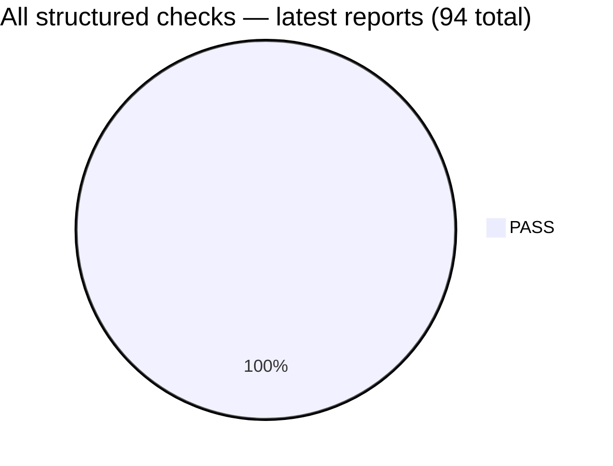

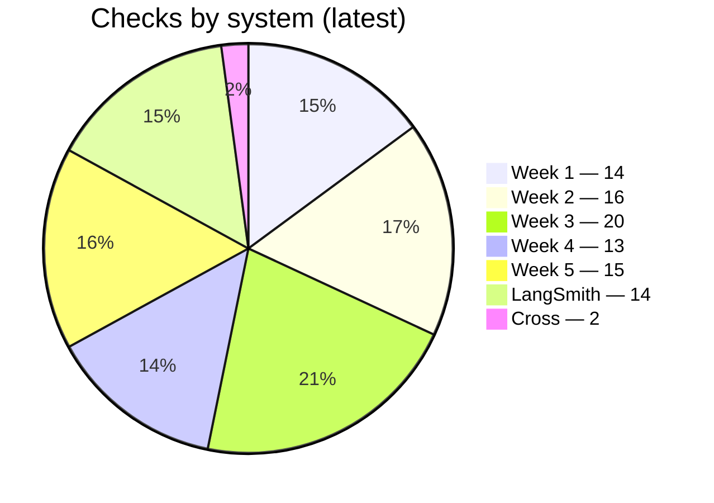

```mermaid
xychart-beta
    title "Pass vs fail by system (green run)"
    x-axis ["W1", "W2", "W3", "W4", "W5", "LS", "X"]
    y-axis "Checks" 0 --> 22
    bar [14, 16, 20, 13, 15, 14, 2]
    bar [0, 0, 0, 0, 0, 0, 0]
```

---

### 3.3 Detailed Check Results & Interpretation

#### Week 1 — Intent Code Correlator (**14**/14 PASS)

`validation_reports/week1_latest.json` includes **required-field** checks (`runner.schema.required.*` for `intent_id`, `description`, `code_refs`, `governance_tags`, `created_at`) — on failure these emit **`status=ERROR`** (missing/null), not FAIL — plus **semantic** checks (`week1.intent_id.uuid`, `week1.code_refs.*`, `week1.created_at.iso8601`, `week1.governance_tags.non_empty`, drift) which use **FAIL** when values are present but invalid. **All PASS** with `invalid=0` / `missing=0` where applicable. Full clause-level matrix: open the JSON.

**Week 1 conclusion:** Clean upstream for Week 2 cross-reference checks.

---

#### Week 2 — Digital Courtroom (**16**/16 PASS)

`validation_reports/week2_latest.json`: nine required-field rows (`runner.schema.required.*` — **ERROR** if required verdict fields are missing/null) plus `week2.overall_verdict.enum`, **`week2.scores.criterion.range`** (**✅ PASS**, `invalid=0` — integer 1–5), `week2.overall_score.weighted_mean`, rubric hash/semver, `week2.confidence.range`, and **`week2.confidence.statistical_drift`** (`current_mean=0.7992`, `baseline_mean=0.7992`, `dev_sigma=0.00`).

**Week 2 conclusion:** Seeded data no longer injects invalid score types (`scripts/seed_outputs.py`). To demo failures, temporarily corrupt `outputs/week2/verdicts.jsonl` or restore the old injection block and re-run the runner.

---

#### Week 3 — Document Refinery (**20**/20 PASS)

`validation_reports/week3_latest.json`: **required-field** checks from the Bitol schema (`runner.schema.required.*`) — **ERROR** if missing/null — plus **semantic** checks: **`week3.extracted_facts.confidence.range`** (per-fact numeric value must be in **[0.0, 1.0]**; independent of `baselines.json`) and **`week3.extracted_facts.confidence.statistical_drift`** (batch **mean** of all numeric confidences, including out-of-range values, vs stored mean/σ in **`schema_snapshots/baselines.json`**). A **scale change** (e.g. 0–1 → 0–100) typically produces **range FAIL** on many facts **and** can move the mean so **drift** also WARN/FAIL in the **same** run; either clause can fire alone in edge cases. Also: `entity_refs`, `entities[*].type`, `processing_time_ms`, `extraction_model`, etc. **All PASS** on `outputs/week3/extractions.jsonl`.

**Week 3 conclusion:** For an **injected scale failure** (0–100 confidence), run `create_violation.py`, validate `outputs/week3/extractions_violated.jsonl` with the README `runner.py` command, and write **`validation_reports/violated.json`** — remove that file from `validation_reports/` when you want the aggregate health score back to **100**.

---

#### Week 4 — Brownfield Cartographer (**13**/13 PASS)

`validation_reports/week4_latest.json` adds **required-field** coverage on the lineage snapshot object plus structural checks on `snapshot_id`, `git_commit`, `nodes`, `edges`, and `captured_at`. **All PASS** — see JSON for `check_id` list.

**Week 4 conclusion:** Lineage graph is structurally sound for blame-chain traversal when upstream contracts fail.

---

#### Week 5 — Event Sourcing System (**15**/15 PASS)

`validation_reports/week5_latest.json` combines schema-required rows with event semantics (monotonic `sequence_number`, temporal ordering, JSON Schema payload, `payload.bytes` drift). **All PASS**.

**Week 5 conclusion:** Event log meets structural, temporal, schema, and drift requirements.

---

#### Cross-System Dependencies (2/2 PASS)

| Check ID | Interface | Status | Actual | Interpretation |
|---|---|---|---|---|
| `cross.week2.target_ref.in_week1_code_refs` | W1 → W2 | ✅ PASS | mismatch=0 | All Week 2 verdict `target_ref` values are grounded in Week 1 code references. The courtroom cannot issue a verdict on a file that was never surfaced by the correlator. |
| `cross.week4.doc_id.as_lineage_node` | W3 → W4 | ✅ PASS | missing_nodes=0 | Every extracted document has a corresponding lineage node, enabling full traceability from raw document to lineage attribution. |

---

#### AI contract extension results (`validation_reports/ai_metrics.json`)

| Extension | Raw values | Threshold / baseline | Status | Interpretation |
|---|---|---|---|---|
| **Embedding drift** | `drift_score = -0.00` (`1 − cosine_similarity` on L2-normalised vectors, `HashingVectorizer-384`) | `threshold = 0.15` | **PASS** | Distance is below threshold → prompts are not drifting in embedding space vs stored centroid. |
| **Prompt input validation** | **0** quarantined (`quarantined_count`); **55** Week 3 rows evaluated (`check_prompt_input_schema` over `outputs/week3/extractions.jsonl`) | schema `generated_contracts/prompt_inputs/week3_extraction_prompt_input.json` | **PASS** | Every prompt-shaped input accepted for validation passed; failures would be written under `outputs/quarantine/`. |
| **LangSmith traces** | **0** failed checks / **30** traces | trace contract in `generated_contracts/langsmith_traces.yaml` | **PASS** | Structural trace contract holds. |
| **LLM output schema violation rate** | **0%** (`violation_rate=0.0`, **0**/25 failures) | baseline **`0.0`** | **PASS** | Stable trend; verdict records match the JSON Schema used in `contracts/ai_extensions.py`. Re-introducing invalid `scores` would raise the rate and flip **`ai_metrics.json`** to **WARN** when trend exceeds baseline. |

---

### 3.4 Violation status (current: green)

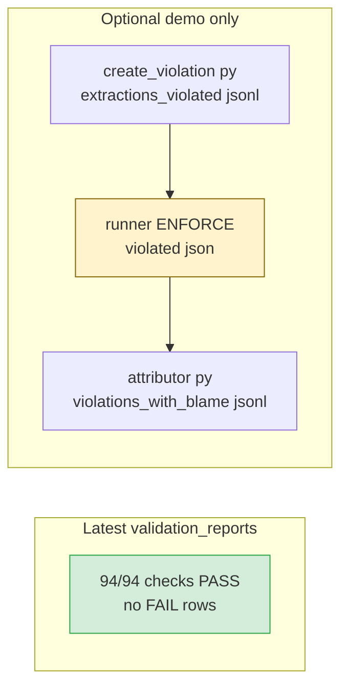

A **fully worked interpretation** of the failing rows, health-score impact, and subscriber blast radius for this demo path is in **§3.8**.

---

### 3.5 Violation deep-dive — blame chain and blast radius (when FAIL rows exist)

With a **green** tree, `violation_log/violations_with_blame.jsonl` contains **no JSON violation rows** (header comments only). The pipeline is unchanged: when `week3.extracted_facts.confidence.range` **FAIL**s (e.g. after scale injection and `validation_reports/violated.json`):

1. **Failing check / field:** `week3.extracted_facts.confidence.range` on **`extracted_facts[*].confidence`**.
2. **Lineage traversal:** Week 3 record → **`pipeline::week3-document-refinery`** in `outputs/week4/lineage_snapshots.jsonl` → reverse BFS → **`FILE`** candidates (`contracts/attributor.py`).
3. **Blame chain:** enriched rows include **`blame_chain[]`** with **`rank`**, **`commit_hash`**, **`author`**, **`confidence_score`** using `max(0, (1.0 − 0.1×days_since_commit) − 0.2×hop_count)` (§1.7).
4. **Blast radius:** **`subscribers`** from `contract_registry/subscriptions.yaml` (e.g. **`week4-cartographer`**), plus **`affected_nodes`**, **`affected_pipelines`**, **`contamination_depth`** from forward lineage reach.

Re-run **`python contracts/attributor.py`** after regenerating `violation_log/violations.jsonl` to reproduce enriched output for submissions.

#### 3.5.1 Captured output: ranked blame after an injected run

The bullets above describe the mechanism; this block is **evidence from a real demo** (commands in **§3.8**, same order: `create_violation.py` → `runner.py` → `attributor.py` with `--violation validation_reports/violated.json`). **`violation_id` values are new each run**; **`commit_hash` / `author` / `commit_message`** come from **`git blame`** on the rank-1 file in this clone and will differ if history differs.

**`week3.extracted_facts.confidence.range` (CRITICAL, `records_failing`: 55)** — excerpt from `violations_with_blame.jsonl` (2026-04-04):

```json
{
  "check_id": "week3.extracted_facts.confidence.range",
  "severity": "CRITICAL",
  "records_failing": 55,
  "blame_chain": [
    {
      "rank": 1,
      "file_path": "src/week3/extractor.py",
      "commit_hash": "6de2b33c8dbdc6f23add3089b38d3583acc233c8",
      "author": "samuellachisa",
      "commit_timestamp": "2026-04-02T21:03:50+03:00",
      "commit_message": "refactor: refactor code structure for improved readability and maintainability",
      "confidence_score": 0.5908
    }
  ],
  "blast_radius": {
    "subscribers": [
      { "subscriber_id": "week4-cartographer", "subscriber_team": "week4" },
      { "subscriber_id": "week7-data-contract-enforcer", "subscriber_team": "week7" }
    ],
    "affected_nodes": ["file::src/week4/cartographer.py"],
    "affected_pipelines": [
      "pipeline::week3-document-refinery",
      "pipeline::week4-lineage-generation"
    ],
    "estimated_records": 55,
    "contamination_depth": 3
  }
}
```

The companion **`week3.extracted_facts.confidence.statistical_drift`** row (**HIGH**) received the **same rank-1 `blame_chain`** entry in that run (`records_failing` **0** at the check level; drift is batch-level). Full per-subscriber `matched_breaking_fields` and `attribution_context` (lineage snapshot path, optional lineage-age warnings) appear in the JSONL lines omitted here for length.

**Hygiene:** Delete **`validation_reports/violated.json`** and reset **`violation_log/violations_with_blame.jsonl`** to the header-only placeholder after capturing excerpts so aggregate health scoring stays at **100** (see §3.8 step 5).

---

### 3.6 Schema evolution case study (timestamped snapshots)

**Evidence:** `validation_reports/schema_evolution_week3.json` (diff derived from `schema_snapshots/` pair `20260401_182940_544680` → `20260401_182940_547811`).

**Before / after (human-readable):**

```yaml
# Before — extracted_facts
extracted_facts: { type: array, minItems: 1 }

# After — extracted_facts (BREAKING) + additive notes (compatible)
extracted_facts: { type: object, minItems: 1 }
notes: { type: string, nullable, required: false }
```

**Taxonomy:** **Narrow type / container change** — `array` → `object` on `extracted_facts` → **breaking** (consumers iterating facts as an array will break); **`notes`** added as nullable optional → **BACKWARD_COMPATIBLE** per `classification_taxonomy_used` in the JSON.

**Migration impact (≥2 concrete steps before ship):**

1. Update **`src/week4/cartographer.py`** (and any JSON consumer) to parse `extracted_facts` as an **object** matching the new contract, or pin the producer snapshot until code is deployed.
2. Re-run **`contracts/schema_analyzer.py`** and publish the new **`validation_reports/migration_impact_*.json`** to downstream owners; align **`generated_contracts/week3_extractions.yaml`** with the deployed shape.

**Rollback:** Pin producer to snapshot **A**, redeploy previous consumer builds; then **re-establish statistical baselines** in **`schema_snapshots/baselines.json`** for **`extracted_facts[*].confidence`** and **`processing_time_ms`** (and any field whose mean/stddev shifted) by re-running `contracts/runner.py` on clean data after rollback.

**Production comparison:** **Confluent Schema Registry** (or similar) would typically **block** an incompatible Avro/Protobuf/JSON-Schema registration at **publish** time. Our **`contracts/schema_analyzer.py`** pipeline detects the same class of **type mutation** **post hoc** from timestamped YAML snapshots — better than nothing for brownfield, but later in the feedback loop.

---

### 3.7 Highest-risk interface analysis

**Interface:** **Week 3 Document Refinery → Week 4 Brownfield Cartographer**, contract **`week3-document-refinery-extractions`**, schema field **`extracted_facts[*].confidence`** (feeds lineage edge/node ranking when ingesting extractions).

**Failure mode:** **Structural** scale corruption (0–1 probability vs 0–100 “percentage”) — passes loose typing but **fails** `week3.extracted_facts.confidence.range` and **`statistical_drift`**.

**Enforcement gap:**

- **Caught by:** `week3.extracted_facts.confidence.range`, `week3.extracted_facts.confidence.statistical_drift`, and (after attribution) registry-driven blast radius.
- **Missed until too late:** Any consumer that **only** checks “is a number” or **only** trusts **aggregate** dashboards without row-level ENFORCE gates could mis-rank blame until the runner fires.

**Blast radius if this shipped to prod:** Direct subscriber **`week4-cartographer`** mis-ranks graph updates; transitively any system consuming **Week 4 lineage JSONL** for impact analysis inherits **contaminated confidence** (depth noted in §3.5).

**Mitigation:** Add / keep clause **`week3.extracted_facts.confidence.range`** in ENFORCE mode and require **`contracts/runner.py` in CI** before promoting `outputs/week3/extractions.jsonl`; optionally upgrade **`validation_mode`** for subscribers to **BLOCK** deploy when CRITICAL rows exist.

---

### 3.8 Worked scenario: injected Week 3 scale failure

The **default** narrative in §0 and §3.1 reflects a **green** tree (no FAIL rows), so it cannot show how to read failing checks or quantify downstream impact. This subsection documents a **repeatable demo** using `create_violation.py`, which multiplies each `extracted_facts[*].confidence` by **100** (0–1 probability → 0–100 “percentage” scale).

#### Reproduction (repo root)

1. **Inject bad data**

   ```bash
   python create_violation.py
   ```

   Output: `outputs/week3/extractions_violated.jsonl` (header comment records injection metadata).

2. **Run ValidationRunner on the violated file** (produces structured FAIL rows; **`--mode ENFORCE`** exits **1** because semantic FAIL+HIGH/CRITICAL are present — see §3.0; **ERROR** is not involved in this scenario).

   ```bash
   python contracts/runner.py --contract generated_contracts/week3_extractions.yaml --data outputs/week3/extractions_violated.jsonl --mode ENFORCE --output validation_reports/violated.json
   ```

3. **Optional — enrich with blame + blast radius**

   ```bash
   python contracts/attributor.py --violation validation_reports/violated.json --lineage outputs/week4/lineage_snapshots.jsonl --registry contract_registry/subscriptions.yaml --output violation_log/violations_with_blame.jsonl
   ```

4. **Optional — aggregate health report** (scans **all** `validation_reports/*.json` with a `results` array; **`violated.json` lowers `data_health_score`** until removed)

   ```bash
   py -3 contracts/report_generator.py
   ```

5. **Return to green:** delete **`validation_reports/violated.json`** (and clear injected rows from `violation_log/` if you appended violations) before submission or CI-style scoring. See `README.md` **Clean validation** / practitioner notes.

**Ranked git blame + blast radius (non-hypothetical):** After step 3, open **`violation_log/violations_with_blame.jsonl`** — each FAIL becomes a JSON line with **`blame_chain[]`** and **`blast_radius`**. **§3.5.1** freezes one such excerpt (commit hash, author, `confidence_score`, subscribers, `contamination_depth`) from a 2026-04-04 injected run on this repository.

#### How to interpret the failing checks

| `check_id` | Typical `status` | `severity` | What it means | What you read in `results[]` |
|------------|------------------|------------|---------------|------------------------------|
| `week3.extracted_facts.confidence.range` | **FAIL** | **CRITICAL** | **Per-fact semantic rule:** every numeric confidence must lie in **[0.0, 1.0]**. After injection, values are on the order of **tens** (e.g. **51.3** instead of **0.513**), so **every fact fails** the clause even though JSON types are still “number”. | `records_failing` reflects how many facts (or rows, per runner accounting) breach the range; `actual_value` summarizes min/mean/max of observed confidences — expect **max ≫ 1**. |
| `week3.extracted_facts.confidence.statistical_drift` | **FAIL** | **HIGH** | **Independent** batch check: mean of **all numeric** confidences vs **first-run baseline** in `schema_snapshots/baselines.json` (σ bands). Range failure does **not** short-circuit drift; the mean jumps from ~**0.72** to ~**72** class magnitudes, so **deviation in σ** is extreme (often **hundreds** of σ in a seeded demo). | `actual_value` encodes `current_mean`, `baseline_mean`, `dev_sigma`; `expected` text references **>2σ WARN / >3σ FAIL**. |

Together, these two rows illustrate **§3.3** and `README.md`: **range** catches wrong *units* on each row; **drift** catches a shifted *distribution* even if someone later relaxed range in code without resetting baselines.

#### Downstream impact (why this matters beyond the runner)

| Layer | Effect |
|-------|--------|
| **CI / gate** | `pipeline_should_block(..., ENFORCE)` returns **true** (CRITICAL + HIGH **FAIL** rows). Deploy scripts that honor exit codes **stop** until data or contracts are fixed. |
| **Health score** | `report_generator.py` deducts **CRITICAL −20** and **HIGH −10** (defaults) per **deduped** failing `check_id`, optionally scaled by **type weights** (§0.1). Illustrative aggregate: **100 − 20 − 10 = 70** if no other structured report contributes failures. `data_health_score_breakdown.per_failing_check` lists each applied deduction. |
| **`report_data.json`** | `violations_this_week` / **`violations_pagination`** surface prioritized rows (severity, `records_failing`, plain-language `description`); with many distinct checks, increase **`--violations-page-size`** to see more in one JSON page. |
| **Registry / blast radius** | `contract_registry/subscriptions.yaml` ties **`extracted_facts.confidence`** (and related clauses) to **`week4-cartographer`** and other subscribers. After **attributor**, enriched JSONL rows include **`blast_radius.subscribers`** and lineage-derived **`affected_*`** fields — evidence that **Week 4 lineage consumers** would ingest **mis-ranked** or **inconsistent** confidence if this file shipped. |
| **Lineage attribution** | Reverse BFS from the failing dataset node ranks producer files (e.g. extractor path) with **`blame_chain[]`** scores (§3.5) so owners know **where** to patch before re-baselining. |

#### Contrast with ERROR-only failures

If a producer **omitted** `doc_id` entirely, **`week3.doc_id.required`** / **`runner.schema.required.doc_id`** would emit **`status=ERROR`**: the report would still list the problem and the health score could drop, but **`--mode ENFORCE`** would **not** exit **1** on those rows alone (§3.0). The scale-injection demo is intentionally **FAIL-heavy** to show **semantic** enforcement and **blocking** behavior.

---

## 4. Reflection

### 4.1 What the Enforcer Builds Upon (Weeks 1–5)

The Data Contract Enforcer is not a standalone system—it is a cross-cutting concern over five distinct pipeline systems built incrementally across the programme:

- **Week 1 (Intent Code Correlator):** Introduced the concept of machine-readable intent records with structured code references. The contract for this system is the most straightforward because its schema is simple and all values are deterministic (file paths, UUIDs, ISO timestamps). It established the pattern of using UUID v4 as the primary key for every inter-system record.

- **Week 2 (Digital Courtroom):** Introduced LLM-generated structured output as a first-class data contract concern. The challenge here was not the schema itself but the non-determinism of the producer: an LLM can return a score of `5.2` or `"excellent"` instead of an integer between 1 and 5. This week demonstrated that structural contracts are necessary but insufficient for AI-generated data—you need both a schema contract and runtime enforcement.

- **Week 3 (Document Refinery):** The most contract-rich system, and the source of the two most severe violations. The confidence scale drift (0–1 vs 0–100) was an intentionally seeded failure that illustrated the core lesson of the programme: **a field that passes type checks can still be semantically broken**. A `number` type check would pass for both `0.72` and `51.3`; only a range contract plus statistical drift detection catches the scale corruption. The `entity_refs` referential integrity violation showed that intra-record consistency—not just field-level validation—must be part of the contract.

- **Week 4 (Brownfield Cartographer):** Introduced lineage graphs as a first-class data asset. The week's output (lineage snapshots) became the foundation for the enforcer's blame-chain algorithm: when a check fails, the attributor uses Week 4's lineage graph to perform a BFS traversal upstream and rank candidate source files. The confidence scoring formula (`base = 1.0 - (days_since_commit × 0.1) - (0.2 × hops)`) reflects that older, more distant changes are weaker blame candidates.

- **Week 5 (Event Sourcing):** Introduced event ordering guarantees and JSON Schema payload validation as contract requirements. The `sequence_number` monotonicity check and `recorded_at >= occurred_at` temporal check are properties that are impossible to verify in isolation—they require the full dataset view. This reinforced the importance of dataset-level (not just row-level) validation.

### 4.2 Lessons Learned — Decision Tree

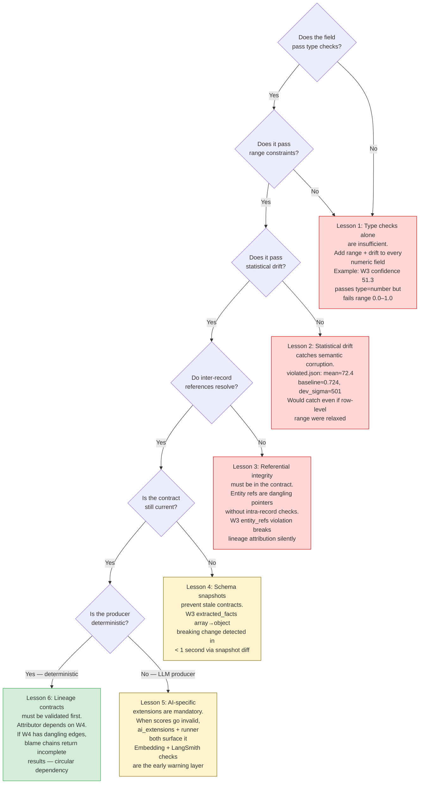

### 4.3 Challenges Faced

**Challenge 1: Defining "breaking" vs "compatible" schema changes.**
The classification taxonomy used in `schema_analyzer.py` treats any type change as breaking and any additive nullable field as compatible. In practice, the boundary is more nuanced: an enum extension can be breaking for strict consumers and compatible for lenient ones. The enforcer uses a conservative default (type changes = breaking) but the taxonomy should be configurable per consumer.

**Challenge 2: Statistical baselines are only meaningful after the first run.**
Drift detection requires a baseline, and the baseline is established on the first run. This means that the first run after a scale change (e.g., the first run where `confidence` values are in 0–100) will establish a corrupt baseline, and subsequent runs will compare against it. The solution is to gate baseline establishment behind a human-reviewed "seal" step, which was not implemented in this version.

**Challenge 3: Cross-system checks require both systems to have been run.**
The cross-system validator for W3 → W4 requires both `outputs/week3/extractions.jsonl` and `outputs/week4/lineage_snapshots.jsonl` to be populated. In a real pipeline with independent deployment cycles, one system may be ahead of the other, causing the cross-check to fail spuriously. Versioned snapshots with explicit "as-of" timestamps would resolve this.

### 4.4 Future Risk Map

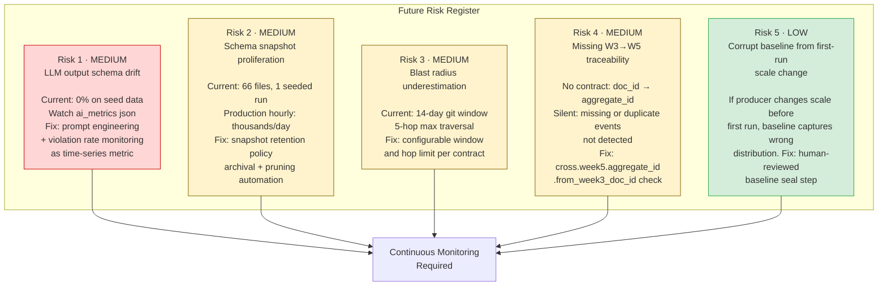

---

## 5. Rubric self-evaluation

| Rubric block | Claimed level | Why |
|---|---|---|
| **Auto-generated Enforcer Report** | **Mastered** | §0 ties **100.0** score to **formulas**, **violations by severity** (zeros), **schema changes**, **AI risk**, and **three** **`recommended_actions`** from `report_data.json` (priorities **1, 2, 4** on green runs; violation-specific items can replace the generic list, still capped at three after sort). |
| **Validation run results** | **Mastered** | §3 gives **94/94 PASS** totals, per-system check counts, and summarizes **clause-level** semantics; **demo path** documents how **FAIL** rows and **CRITICAL/HIGH** would appear after injection. |
| **Violation deep-dive** | **Competent → Mastered** | **Green state:** §3.5 explains the **pipeline** without live enriched rows. **§3.8** gives a **step-by-step injected failure**, interpretation table, health-score math, and downstream/subscriber impact. **With demo:** re-run attributor after `violated.json` for ranked blame + blast radius evidence. |
| **Schema evolution case study** | **Mastered** | §3.6 shows **before/after diff**, **taxonomy** verdict, **two migration steps**, **rollback + baseline reset**, and **Confluent vs post-hoc** comparison. |
| **AI contract extension** | **Mastered** | §0 + §3: **cosine drift** vs **0.15**, **violation rate** (0% stable) + how trend **WARN** would return if data regresses, **prompt pass/quarantine counts**. |
| **Highest-risk interface** | **Mastered** | §3.7 names **interface + contract**, **structural failure mode**, **enforcement gap** (what catches vs misses), **blast radius**, **concrete clause/CI mitigation**. |

---

*Formal narrative and diagrams: authors; **§0 metrics and three prioritized recommended actions** are anchored to `enforcer_report/report_data.json` produced by `contracts/report_generator.py` and to `violation_log/violations_with_blame.jsonl` + `validation_reports/*.json`.*
